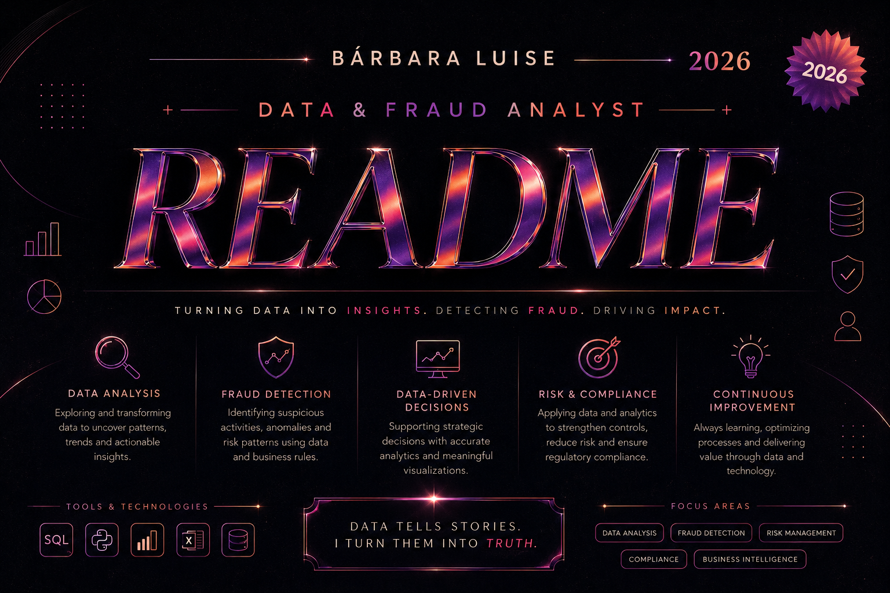

````md
<div align="center">



<br><br>

# BÁRBARA LUISE

### `DATA & FRAUD ANALYST`


<br>

<a href="https://www.linkedin.com/in/barbara-luise-silva-rodovalho-1173a0401/">

</a>

</div>

---

#  ABOUT ME

```yaml
name: Bárbara Luise
role: Data & Fraud Analyst

focus:
  - Fraud Detection
  - Data Analytics
  - Risk Analysis
  - Business Intelligence
  - Compliance

currently_learning:
  - Advanced SQL
  - Tableau
  - Fraud Analytics
  - Data Visualization

mission:
  Turning data into strategic decisions through analytics and fraud prevention.
```

---

#  TECH STACK

<div align="center">


<br><br>


</div>

---

#  FEATURED PROJECTS

##  Fraud Detection SQL Project

> Financial transaction analysis focused on suspicious behavior detection and anomaly identification.

### Tools Used
- SQL
- PostgreSQL
- Excel
- Tableau

---

##  Transaction Analytics Dashboard

> Interactive dashboard developed to monitor KPIs, anomalies and business trends.

### Focus Areas
- Fraud Monitoring
- Risk Analysis
- Data Visualization
- Strategic Reporting

---

#  GITHUB STATS

<div align="center">


</div>

---

#  CONTRIBUTION GRAPH

<div align="center">


</div>

---

#  CERTIFICATIONS

- LGPD Fundamentals  
- Excel for Data Analysis  
- Fraud Prevention Basics  
- SQL & Relational Databases  

---

#  CURRENT GOALS

- Improve analytical workflows  
- Build advanced fraud detection projects  
- Deepen SQL knowledge  
- Develop business intelligence solutions  

---

<div align="center">

#  DATA TELLS STORIES.
## I TURN THEM INTO TRUTH.

<br>


</div>
````
